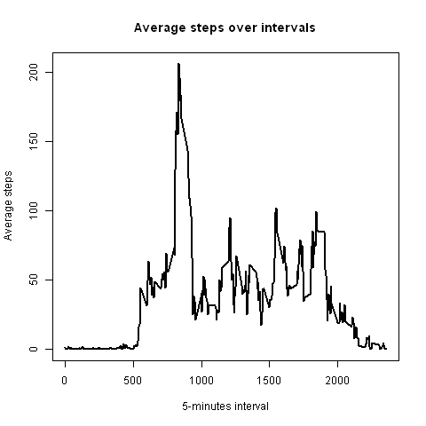
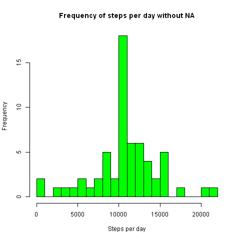
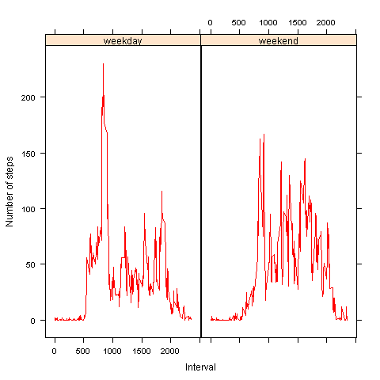

---

---

Reproducible Research: Peer Assessment 1
========================================


##Loading and preprocessing the data


```{r}

data <- read.csv("activity.csv")
print(head(data),type="html")

```

##What is mean total number of steps taken per day?

**1.- Total number of steps per day (ignoring missing values)**


```{r}
steps_per_day <- aggregate(data$steps ~ data$date, data, sum)

names(steps_per_day)[1] <- "date"
names(steps_per_day)[2] <- "steps"

head(steps_per_day)

```

**2,- Histogram of total number of steps taken each day**


```{r fig.width=5, fig.height=4}

hist(steps_per_day$steps,breaks=20,col="green",xlab="Steps per day",main="Frequency of steps per day")


```


**3.- Mean and median of the total number of steps taken per day**


```{r}
mean(steps_per_day$steps)
median(steps_per_day$steps)
```


##What is the average daily activity pattern?

**1.- Time series plot of the 5-minutes interval and the average number of steps taken, averaged across all days**


```{r}

av_steps_per_interval <- aggregate(data$steps ~ data$interval, data, mean)

names(av_steps_per_interval)[1] <- "interval"
names(av_steps_per_interval)[2] <- "av_steps"

```

```{r fig.width=5, fig.height=4}
plot(x <- av_steps_per_interval$interval ,y <- av_steps_per_interval$av_steps , type="l",lwd=2,col="black",ann=FALSE)

title(main="Average steps over intervals",xlab="5-minutes interval",ylab="Average steps")

```


**2.- Which 5-minute interval, on average across all the days in the dataset, contains the maximum number of steps?**

```{r}
max_av_steps <- max(av_steps_per_interval$av_steps)
which(av_steps_per_interval$av_steps ==  max_av_steps)
av_steps_per_interval$interval[104]

```

##Imputing missing values

**1.- Total number of missing values in the dataset**


```{r}
sum(is.na(data$steps))
```

**2.- Filling all the missing values in the dataset**

I use the mean for that 5-minute interval to fill the missing values

```{r}
vna <- numeric()
for (i in 1:nrow(data)){
     exp <-data[i, ]
     if (is.na(exp$steps)) {
          steps <- subset(av_steps_per_interval,interval==exp$interval)$av_steps
     } else {
          steps <- exp$step
     }
     vna <- c(vna,steps)
}
```

**3.- New Dataset with the missing data filled in the original**

```{r}
data_without_na <- data
data_without_na$steps <- vna
```

**4.- Histogram of the number of steps taken each day**

```{r}
steps_per_day_without_na <- aggregate(data_without_na$steps ~ data_without_na$date, data_without_na, sum)
names(steps_per_day_without_na)[1] <- "date"
names(steps_per_day_without_na)[2] <- "steps"
```

```{r fig.width=5, fig.height=4}
hist(steps_per_day_without_na$steps,breaks=20,col="green",xlab="Steps per day",main="Frequency of steps per day without NA")
```



```{r}

mean(steps_per_day_without_na$steps)
median(steps_per_day_without_na$steps)

```

The mean and the meadian have the same values. The median is a bit diferent than before. 
The main impact in the histogram we can see is the frequency is higher over the value 10000 at 'Steps per day'


##Are there differences in activity patterns between weekdays and weekends?

**1.- Create a new factor variable in the dataset with two levels -"weekday" and "weekend"**

```{r}
for (i in 1:nrow(data_without_na)){
      day <- weekdays(as.Date(data_without_na$date[i]))
      if (day == "domingo" || day == "sábado") {
          data_without_na$weekd[i] <- "weekend"
      }else{
          data_without_na$weekd[i] <- "weekday"
      }
}
 
data_without_na$weekd <- factor(data_without_na$weekd)
levels(data_without_na$weekd)
```

**2.- Panel plot containing a time series plot of the 5-minute interval and the average number of steps taken, averaged across all weekday or weekend days**

```{r}
av_steps_per_interva_by_day <- aggregate(steps ~ interval + weekd, data=data_without_na , mean)
names(av_steps_per_interva_by_day) <- c("interval", "daylevel", "steps")
```

```{r fig.width=10, fig.height=6}
library(lattice)

xyplot(steps ~ interval | daylevel,av_steps_per_interva_by_day , type = "l", col="red", layout= c(2, 1), xlab = "Interval", ylab = "Number of steps")
 ```

